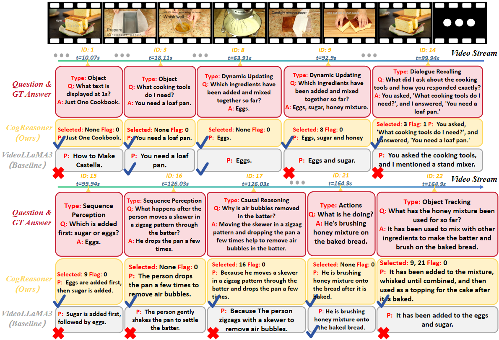

# CogStream: Context-guided Streaming Video Question Answering

<div align="center">
[](https://arxiv.org/abs/2506.10516)
[](https://zenodo.org/records/15870909)
</div>

This repository is the official implementation of **CogStream: Context-guided Streaming Video Question Answering**.
<div align="center">
  
</div>
<p align="center"><em>Figure 1: An overview of our proposed CogReasoner model.</em></p>

## 1. Introduction

Despite advancements in Video Large Language Models (Vid-LLMs), significant challenges persist in streaming video reasoning. The core issues are twofold: the immense computational burden from processing ever-growing historical context, and the model's distraction by irrelevant information, which undermines the reasoning process.

To address this, we introduce **CogStream**, a new and challenging task named **Context-guided Streaming Video Reasoning**. This task simulates real-world scenarios, requiring models to intelligently identify and utilize the most relevant historical context to answer questions about an ongoing video stream.

To support this research, we present:
- **A new, densely annotated dataset** featuring extensive and hierarchical question-answer pairs, built via a semi-automatic pipeline.
- **CogReasoner**, a novel baseline model that efficiently tackles the CogStream task by leveraging **Visual Stream Compression** and **Historic Dialogue Retrieval**.

## 2. The CogStream Dataset
The CogStream dataset is designed to evaluate and validate a model's capabilities in context-guided streaming video reasoning.

**Data Sources:** We collected 6,361 videos from six public sources: MovieChat (40.2%), MECD (16.8%), QVhighlights (9.8%), VideoMME (6.5%), COIN (18.0%), and YouCook2 (8.6%).
**Scale:** The final dataset comprises 1,088 high-quality videos and 59,032 QA pairs, formally split into a training set (852 videos) and a testing set (236 videos).
**Key Features:** QA pairs are categorized into three types based on the required temporal context: **Basic QA**, **Streaming QA**, and **Global QA**. Many questions in the Streaming and Global categories require referencing previous dialogue turns for accurate answering, testing a model's deep reasoning abilities.

<div align="center">
  
</div>
<p align="center"><em>Figure 2: An illustration of the CogStream task and the hierarchical structure of our dataset.</em></p>

**➡️ [Download the Dataset from Zenodo](https://zenodo.org/records/15870909)**

*For detailed instructions on generating your own dataset using our pipeline, please see the guide in the generation directory: [`./dataset_gen_pipeline/README.md`](./dataset_gen_pipeline/README.md).*

## 3. The CogReasoner Model

Our proposed `CogReasoner` framework is designed to efficiently process streaming video and dialogue by focusing on relevant information. It consists of three key modules:

1.  **Visual Stream Compression:** This module intelligently processes the incoming video stream. It uses **Temporal-Semantic Clustering** to group frames into coherent events and then employs **Question-aware Streaming Compression** to preserve relevant events in high detail while aggressively compressing less relevant ones.
2.  **Historic Dialogue Retrieval:** To handle the ever-growing textual context, this module uses an LLM to select only the most relevant historical QA pairs pertinent to the current question. It also determines if a question can be answered using text alone, avoiding unnecessary visual processing.
3.  **Video-text Interleave Reasoning:** Finally, the compressed visual information and the retrieved textual context are interleaved chronologically to form the final input, which the LLM uses to generate the answer.

## 4. Requirements

**Note**: Run all commands from the repository root directory to ensure correct path resolution.

We follow VideoLLaMA3. To install requirements:

```setup
conda env create -f environment.yml
```

Download only the VideoLLaMA3 model weights (.safetensors files) from here and place them in the ./model folder in this repository:

- [VideoLLaMA3](https://huggingface.co/DAMO-NLP-SG/VideoLLaMA3-7B)

## 5. Training

To train the Historic Dialogue Retrieval module in the paper (First Stage), run this command:

```train
torchrun --nproc_per_node=<number of processes> train/language_model_training.py --model_path <path to the base model directory> --QA_path <path to the dataset QA directory>
```

- `--nproc_per_node=<number of processes>`: Specifies the number of processes to run per node, typically set to the number of available GPUs (e.g., 8 for 8 GPUs).

To train the Video-text Interleave Reasoning module in the paper (Second Stage), you need to configure `accelerate` before training. Load the provided `accelerate` configuration file by running:

```bash
accelerate config --load_config accelerate_config.yaml
```

Then, run the training command:

```train
accelerate launch train/second_stage_training.py --model_path <path to the base model directory> --video_dir <directory containing train video files> --query_dir <directory containing train query (QA) files> --num_epochs <training epochs number>
```

## 6. Evaluation

To evaluate our model on CogStream, first run the following command to generate answers on our dataset:

```eval
torchrun --nproc_per_node=<number of processes> evaluate/answer_generate.py --model_path <path to the base model directory> --lora_adapter_1_path <path to the first stage LoRA adapter> --lora_adapter_2_path <path to the second stage LoRA adapter> --video_dir <directory containing test video files> --query_dir <directory containing test query (QA) files> --save_dir <directory to save the result>
```


## 7. Pre-trained Models

Pretrained lora weights will be released soon.

## 8. Results

A visualization of an example result demonstrating the model's performance is shown below.


Performance metrics of different models in 11 **CogStream** capabilities. Prm. denotes the number of model parameters, Frm. denotes the number of sampled frames.

| **Method** | **Prm.** | **Frm.** | **Basic** |       |         |      | **Streaming** |       |       |      |      | **Global** |       | **Avg.**$\uparrow$ |
|-----------------|----------|----------|-----------|-------|---------|------|---------------|-------|-------|------|------|------------|-------|-----------------|
|                 |          |          | Att.      | Obj.  | Co-ref. | Act. | Rea.          | Seq.  | Dial. | Dyn. | Obj. | Over.      | Glob. |                 |
| *Open-Source Models* |          |          |           |       |         |      |               |       |       |      |      |            |       |                 |
| InternVL2       | 7B       | 12/seg   | 52.3      | 59.0  | 36.6    | 36.3 | 52.6          | 41.9  | 39.2  | 39.1 | 43.9 | 52.4       | 59.8  | 48.66           |
| LongVA          | 7B       | 12/seg   | 63.6      | 55.0  | 42.0    | 33.6 | 53.1          | 40.9  | 55.4  | 25.3 | 36.8 | 42.4       | 53.3  | 48.76           |
| VideoLLaMA 2    | 7B       | 20/seg   | 60.0      | 61.7  | 47.8    | 46.4 | 47.5          | 47.4  | 54.1  | 30.2 | 56.8 | 54.3       | 54.8  | 50.72           |
| MiniCPM-o 2.6   | 8B       | 20/seg   | 77.3      | 76.4  | 63.6    | 60.6 | 65.9          | 61.0  | 47.1  | 50.9 | 44.7 | 57.4       | 62.8  | 64.08           |
| VideoLLaMA 3    | 7B       | 1fps     | 75.7      | 71.8  | 62.6    | 64.6 | 67.7          | 61.5  | 56.9  | 52.4 | 60.3 | 66.0       | 72.3  | 66.52           |
| MiniCPM-V-2.6   | 8B       | 20/seg   | **78.6** | 73.6  | 70.7    | 59.6 | **70.5** | 59.7  | 50.0  | 49.2 | **64.5** | 64.2       | 69.4  | 66.84           |
| **CogReasoner** | 7B       | 1fps     | 77.3      | **78.9**| **74.6**| **70.0** | 69.7     | **68.8**| **83.4**| **70.5** | 62.7     | **75.4** | **76.0**| **72.26** |
| *Proprietary Models* |          |          |           |       |         |      |               |       |       |      |      |            |       |                 |
| Gemini 1.5 Pro  | -        | 20/seg   | 75.5      | 73.4  | 66.4    | 62.5 | 66.2          | 61.1  | 64.1  | 42.0 | 36.2 | 69.4       | 74.4  | 66.04           |
| Qwen2-VL-Max    | -        | 50(max)  | 77.2      | **76.7**| **70.4**| **69.2** | 76.7          | 66.5  | 62.3  | **53.7** | 52.4 | 76.2       | 76.6  | 72.58           |
| GPT-4o          | -        | 20/seg   | **78.4** | 73.9  | 68.2    | 66.1 | **77.5** | **72.1**| **73.0**| 52.4 | **44.2** | **77.0** | **79.6**| **73.90** |

## 9. Citation

If you find our work useful for your research, please consider citing our paper:

```bibtex
@article{zhao2025cogstream,
  title={CogStream: Context-guided Streaming Video Question Answering},
  author={Zhao, Zicheng and Wang, Kangyu and Li, Shijie and Qian, Rui and Lin, Weiyao and Liu, Huabin},
  journal={arXiv preprint arXiv:2506.10516},
  year={2025}
}
```

## License

This project is licensed under the [MIT License](LICENSE). All contributions to the code must be made under this license. See the [LICENSE](LICENSE) file for details.


